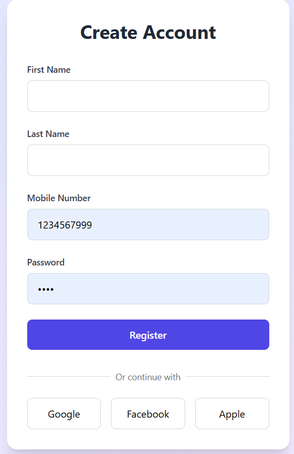
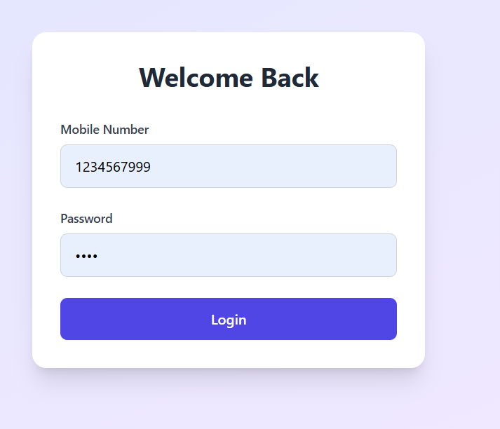
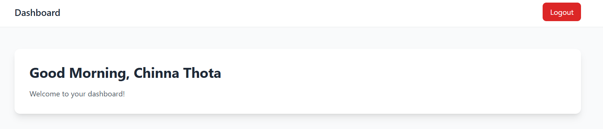

# Equip9: Registration, Login, and Dashboard Application

## Table of Contents
1. [Project Overview](#project-overview)
2. [Features](#features)
3. [Technologies Used](#technologies-used)
4. [Backend Setup](#backend-setup)
5. [Frontend Setup](#frontend-setup)
6. [API Endpoints](#api-endpoints)
7. [How to Run](#how-to-run)
8. [Screenshots](#screenshots)
9. [Future Enhancements](#future-enhancements)

---

## Project Overview
Equip9 is a web application designed to manage user registration, authentication, and personalized dashboard features. It enables users to:
- Register with their personal details.
- Log in securely using mobile number and password.
- Access a personalized dashboard with a contextual greeting.

---

## Features
- User Registration with validation.
- User Login with JWT-based authentication.
- Personalized Dashboard with dynamic greeting messages.
- Logout functionality to end the session.

---

## Technologies Used

### Backend
- **Framework**: Node.js with Express
- **Database**: Clloud clever(MY SQL)
- **Authentication**: JWT (JSON Web Tokens)
- **Deployed On**: Render

### Frontend
- **Framework**: React.js
- **Styling**: Tailwind CSS
- **Routing**: React Router DOM

---

## Backend Setup

### Prerequisites
- Node.js (v16 or higher)
- My Sql (local or cloud)

### Installation
1. Clone the repository:
   ```bash
   git clone https://github.com/your-repo-url
   cd backend
   ```

2. Install dependencies:
   ```bash
   npm install
   ```

3. Configure environment variables:
   Create a `.env` file in the root directory with the following:
   ```env
   PORT=5000
   Password=your-password
   JWT_SECRET=your-secret-key
   ```

4. Run the server:
   ```bash
   npm start
   ```

The backend will run on `http://localhost:5000`.

---

## Frontend Setup

### Prerequisites
- Node.js (v16 or higher)

### Installation
1. Navigate to the frontend folder:
   ```bash
   cd frontend
   ```

2. Install dependencies:
   ```bash
   npm install
   ```

3. Run the application:
   ```bash
   npm start
   ```

The frontend will run on `http://localhost:3000`.

---

## API Endpoints

### Auth Routes
- **POST** `/api/auth/register`
  - Registers a new user.
  - Body:
    ```json
    {
      "firstName": "John",
      "lastName": "Doe",
      "mobileNumber": "1234567890",
      "password": "password123"
    }
    ```

- **POST** `/api/auth/login`
  - Logs in an existing user and returns a JWT token.
  - Body:
    ```json
    {
      "mobileNumber": "1234567890",
      "password": "password123"
    }
    ```

### User Routes
- **GET** `/api/user/profile`
  - Retrieves user details.
  - Requires `Authorization: Bearer <JWT>` header.

---

## How to Run

1. Start the backend server:
   ```bash
   cd backend
   npm start
   ```

2. Start the frontend:
   ```bash
   cd frontend
   npm start
   ```

3. Open your browser and navigate to `http://localhost:3000`.

---

## Screenshots
### Registration Page


### Login Page


### Dashboard


---

## Future Enhancements
- Add password recovery functionality.
- Implement role-based access control.
- Enhance the dashboard with more user statistics and charts.

---

